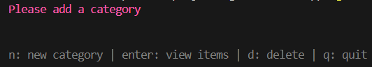
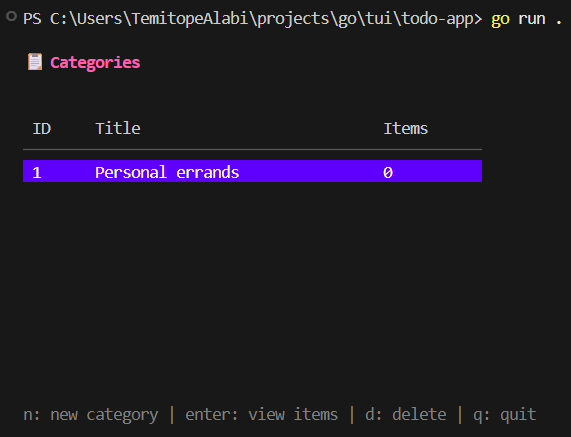
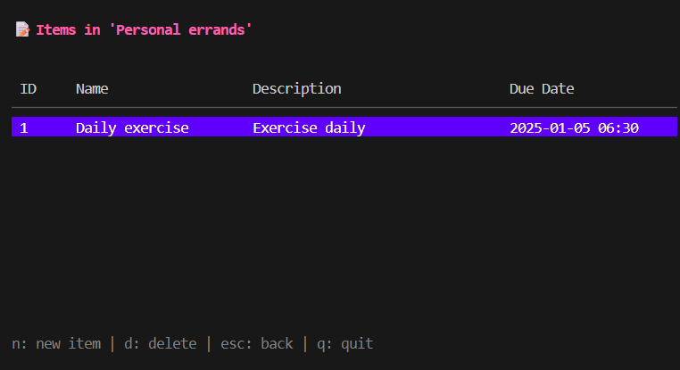

# Todo TUI App — README

---

## Screenshots

- Empty categories prompt:

  

- Categories view with one category selected:

  

- Items view for a selected category:

  

- Add Item flow (addItemView):

  ```
  addItemView
  ```

---

## Overview

The Todo TUI App is a terminal-based task manager built with:
- Bubble Tea (TUI framework)
- Bubbles (components like tables and text inputs)
- Lip Gloss (styling)
- A simple in-memory Todo manager for categories and items

It supports:
- Managing categories (add/delete)
- Managing items within categories (add/delete)
- Multi-step item creation (name → description → due date)
- Navigation and interaction via keyboard shortcuts

The application stores data only in memory and is ideal for quick, lightweight task management inside your terminal.

---

## Features

- Category management:
  - List categories with counts of items
  - Add new categories
  - Delete selected category
  - Navigate across categories with table selection

- Item management:
  - View items within a selected category
  - Add new items via a multi-step form:
    - Name
    - Description
    - Due date (YYYY-MM-DD HH:MM)
  - Delete selected item

- Keyboard-driven:
  - Compact and fast UI with contextual views
  - Helpful prompts and error messages

---

## How It Works

The app has multiple views that you switch between based on actions:

1. Category List View
   - Displays all categories in a table.
   - If no categories exist, shows a prompt to add one.
   - Keys:
     - n → Add new category
     - enter → Open selected category’s items
     - d → Delete selected category
     - q → Quit

2. Item List View
   - Displays items in the currently selected category.
   - Keys:
     - n → Add new item (multi-step form)
     - d → Delete selected item
     - esc → Back to categories
     - q → Quit

3. Add Category View
   - A single input to provide the category name.
   - Keys:
     - enter → Save category
     - esc → Cancel

4. Add Item View (multi-step)
   - Step 1: Name
   - Step 2: Description
   - Step 3: Due date in format YYYY-MM-DD HH:MM
   - Keys:
     - enter → Next/Save
     - esc → Cancel
   - Validation:
     - Empty fields show “Field cannot be empty”
     - Invalid date shows “Invalid date format. Use YYYY-MM-DD HH:MM”

Error messages display in the UI with a ⚠️ indicator.

---

## Key Bindings

- Global:
  - q or ctrl+c → Quit
- Category List:
  - n → Add category
  - enter → Open category’s items
  - d → Delete selected category
- Item List:
  - n → Add item
  - d → Delete selected item
  - esc → Back to categories
- Forms (Add Category / Add Item):
  - enter → Next/Save
  - esc → Cancel

---

## Project Structure

- `todo-app/main.go` — app entry point
- `todo-app/model.go` — TUI model, views, update loop, and rendering logic
- `todo-app/model_test.go` — tests for TUI behavior
- `todo-app/todo/todo.go` — in-memory Todo manager (categories and items)
- `todo-app/todo/todo_test.go` — unit tests for core Todo logic

---

## Requirements

- Go 1.20+ (recommended)
- Internet access for fetching dependencies (first build)

---

## Install and Run

1. Navigate to the app directory:
   ```bash
   cd todo-app
   ```

2. Download dependencies:
   ```bash
   go mod tidy
   ```

3. Run the TUI app:
   ```bash
   go run .
   ```

4. Build a binary:
   ```bash
   go build -o todo-tui .
   ./todo-tui
   ```

---

## Running Tests

Run all tests in the module (includes TUI model and todo logic tests):

```bash
cd todo-app
go test ./...
```

Run only the core todo logic tests:

```bash
cd todo-app
go test ./todo
```

---

## Usage Walkthrough

1. Start the app: `go run .`
2. You’ll land on the Categories view.
3. Press `n` to add a category (e.g., “Work”).
4. Select the category row and press `enter` to view items.
5. Press `n` to add an item:
   - Enter a name (e.g., “Write report”) → press `enter`
   - Enter a description (e.g., “Summary for Q4”) → press `enter`
   - Enter due date (e.g., “2026-01-31 17:00”) → press `enter`
6. The item will be saved and displayed. Use `d` to delete selected items.
7. Press `esc` to go back to categories, `q` to quit.

---

## Data Model

- Category:
  - ID (auto-increment)
  - Title
  - Items (slice of Item)
- Item:
  - ID (auto-increment)
  - Name
  - Description
  - DueDate (time)

All data is in-memory and resets when the app exits.

---

## Notes and Tips

- Due date must be in the exact format: `YYYY-MM-DD HH:MM` (24-hour clock).
- If the app shows an error (e.g., invalid date), the message will appear in red near the bottom of the UI.
- When no categories exist, the Categories view prompts you to add one.
- The UI is keyboard-focused; tables capture navigation. Use arrow keys to move between rows.

---

## Dependencies

- github.com/charmbracelet/bubbletea
- github.com/charmbracelet/bubbles
- github.com/charmbracelet/lipgloss

These are managed via Go modules.

---

## License

This project is provided as-is. Add a license file as needed for your use case.
